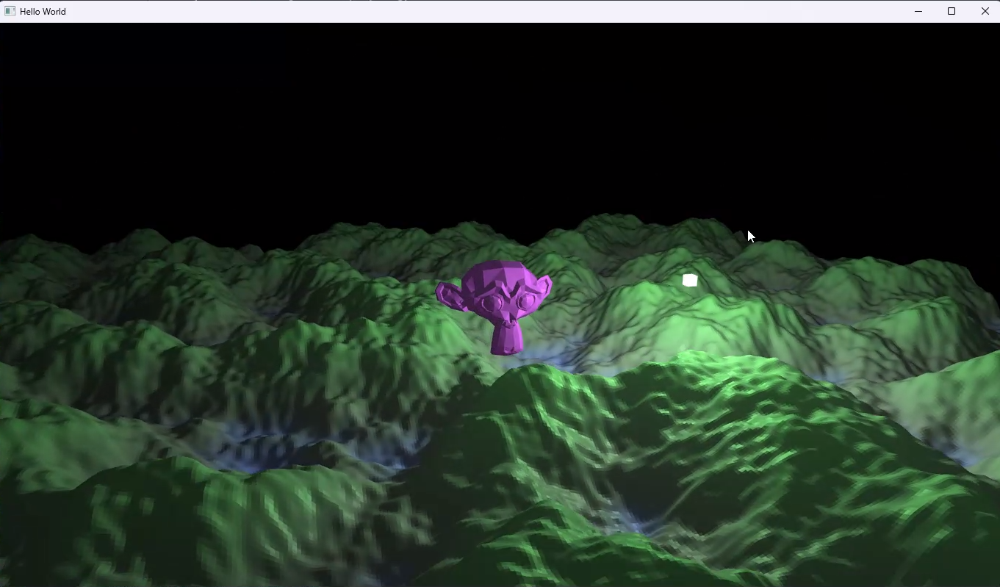
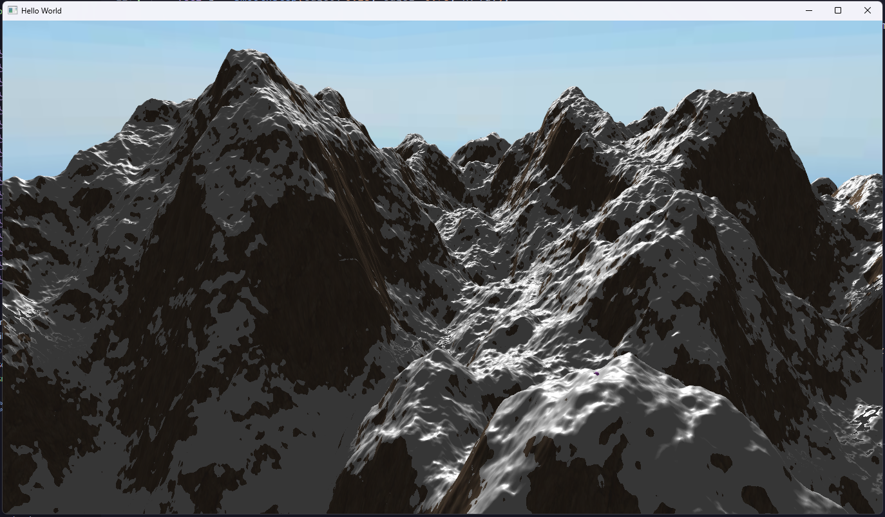
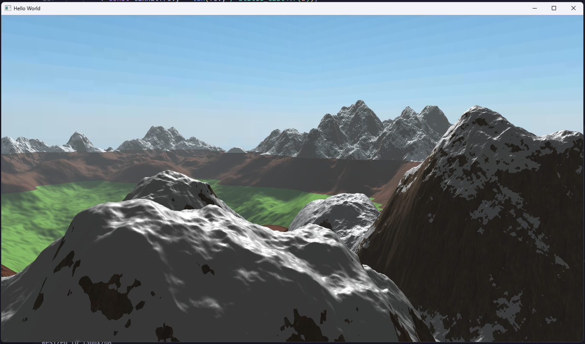

# OpenGL Renderer

This is an OpenGL renderer that i am building mostly to showcase my knowledge of OpenGL and C++ and to gain experience. The end goal is to have a fully procedurally generated world with a day/night cycle and weather system.

## Development Screenshots

## Libraries Used

-   [GLFW](https://www.glfw.org/) - Window and input handling
-   [GLAD](https://github.com/Dav1dde/glad) - OpenGL loader
-   [GLM](https://github.com/g-truc/glm) - OpenGL Math library
-   [SOIL2](https://github.com/SpartanJ/SOIL2) - Loading images and textures
-   [FastNoiseLite](https://github.com/Auburn/FastNoiseLite) - Noise for procedural generation
-   [tinyobjloader](https://github.com/tinyobjloader/tinyobjloader) - Loading `.obj` files
